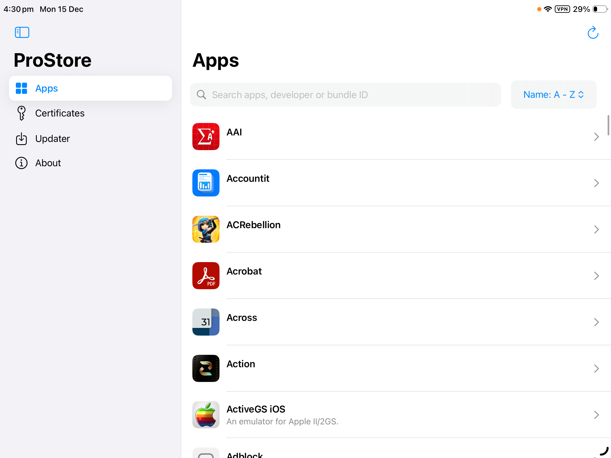
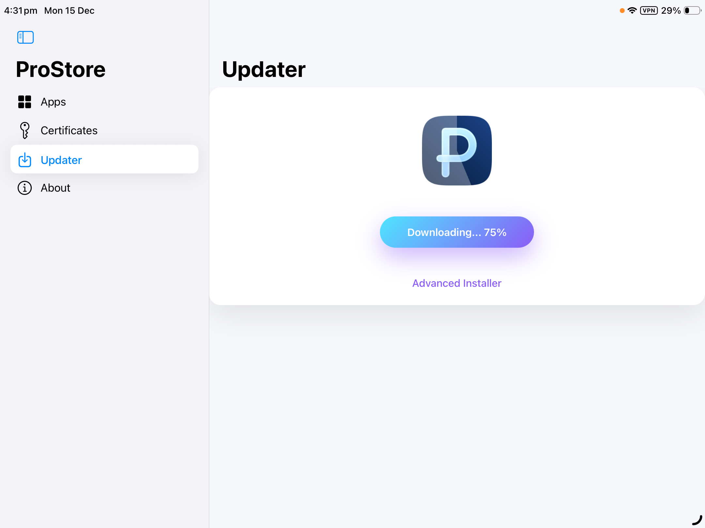

# ProStore

The **best** alternative app store for iOS!  

---

## Install ProStore

<a href="https://prostore-ios.github.io/docs/">**INSTALL GUIDE / DOCUMENTATION**</a>  
or  
<a href="https://ProStore-IOS.github.io/sourceRedirect.html?app=feather">Add to Feather</a>  
<a href="https://ProStore-IOS.github.io/sourceRedirect.html?app=esign">Add to ESign</a>  
<a href="https://ProStore-IOS.github.io/sourceRedirect.html?app=scarlet">Add to Scarlet</a>  
or  
<a href="https://github.com/ProStore-iOS/ProStore/releases/latest">Download IPA</a>

---

## Why ProStore?

- No PC after setup!
- Unlimited app installs!
- Easy certificate management!
- App store or upload .ipa

|  | ProStore | SideStore | AltStore | Esign |
|:-----------|:--------:|:---------:|:--------:|:-----:|
| **No PC for Setup**   | ⏰       | ❌        | ❌       | ✅    |
| **No PC for Every App Install**      | ✅       | ✅        | ❌       | ✅    |
| **Direct Install**      | ✅       | ✅        | ✅       | ❌    |
| **itms-services Install**      | ⏰       | ❌        | ❌       | ✅    |
| **Unlimited Apps**      | ✅       | ❌        | ❌       | ✅    |
| **Custom IPA**      | ⏰       | ✅        | ✅       | ✅    |
| **App Store**      | ✅       | 🟡        | 🟡       | 🟡    |
| **AltStore App Sources**      | ✅       | ✅        | ✅       | ✅    |
| **Certificate Management**      | ✅       | ❌        | ❌       | 🟡    |
| **Official Certificates**      | ✅       | ❌        | ❌       | ❌    |
| **Install via Apple ID**      | ❌       | ✅        | ✅       | ❌    |  

✅ = Full support  
❌ = No support  
⏰ = Coming Soon  
🟡 = Limited Support

---

## Gallery
&nbsp;
&nbsp;
&nbsp;

---

## Star History

<a href="https://www.star-history.com/#ProStore-iOS/ProStore&type=date&legend=top-left">
 <picture>
   <source media="(prefers-color-scheme: dark)" srcset="https://api.star-history.com/svg?repos=ProStore-iOS/ProStore&type=date&theme=dark&legend=top-left" />
   <source media="(prefers-color-scheme: light)" srcset="https://api.star-history.com/svg?repos=ProStore-iOS/ProStore&type=date&legend=top-left" />
   
 </picture>
</a>

---

## To-do list

- [ ] Pairing file selection menu
- [x] Sources Manager
- [ ] Add IPA Manager
- [x] Create settings view (Replace About)
- [ ] Add second install option: OTA Install

---

## Credits
- **NovaDev404** — Developer  
- **[Khcrysalis](https://github.com/khcrysalis/) & [Zhlynn](https://github.com/zhlynn/)** - Creator of the [Zsign Package](https://github.com/khcrysalis/Zsign-Package)  
- **[Khcrysalis](https://github.com/khcrysalis/)** - [iDeviceKit](https://github.com/khcrysalis/idevicekit)  
- **[S0n1c](https://s0n1c.ca/)** - ProStore updater & installer  
- **[AppleP12](https://check-p12.applep12.com/)** - Certificate Checker and Status

---

